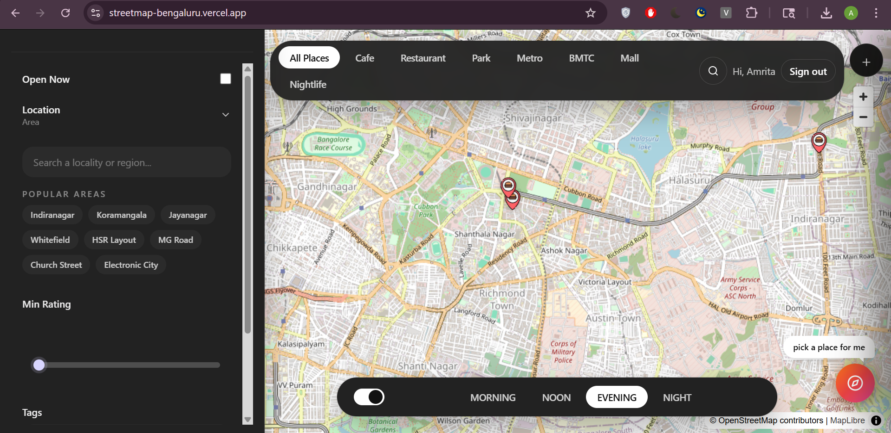
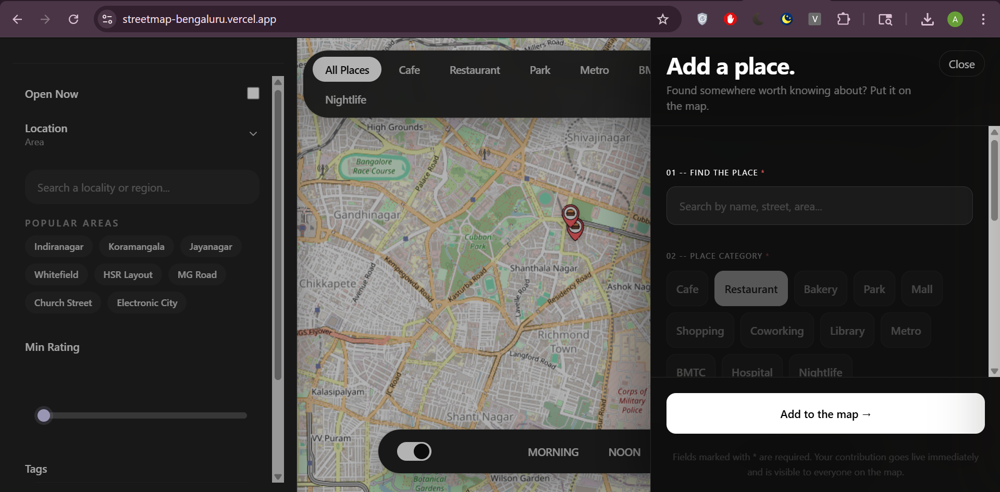
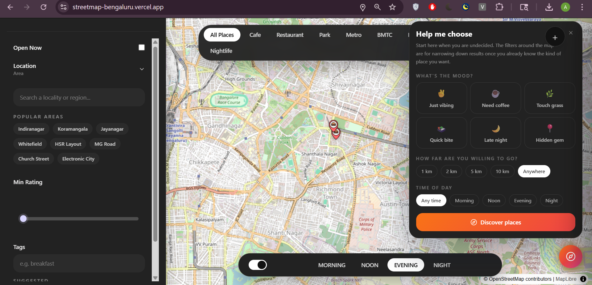
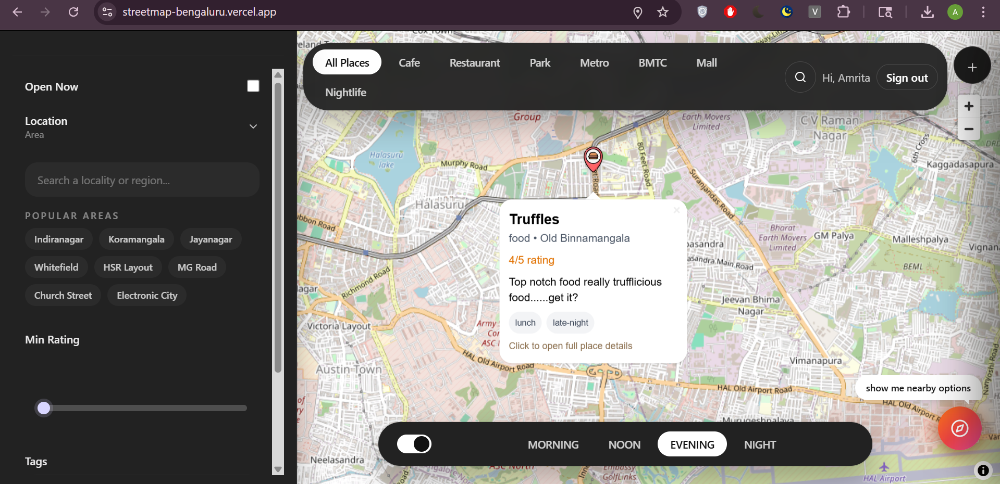

# StreetMap Bengaluru - Time-Aware Community Map

A time-aware, community-driven map that helps users discover places based on what they need, where they are, and what time it is.

---

## Live Demo

[Open StreetMap Bengaluru](https://streetmap-bengaluru.vercel.app/)

## Video Demo

[Video Demo Submission](https://drive.google.com/file/d/1AaOq33R9EysGU_YGc1zYlz-Qo4P22stm/view?usp=sharing)

## Screenshots

### Main Map View


### Add Place Flow


### Recommendation Engine


### Place hover insights


---

## Overview

StreetMap Bengaluru is a time-aware, community-driven mapping platform designed to help users discover places in Bengaluru based on intent, location, and time of day.

Unlike traditional maps, it combines structured data with user-generated insights to create a dynamic and evolving city exploration experience.

---

## Problem Statement

Existing map platforms are:

- Static and not time-aware  
- Focused on listings rather than intent  
- Weak in local discovery and hidden gems  
- Limited in community-driven insights  

Users struggle to find relevant places based on real-world context like time, mood, and locality.

---

## Solution

StreetMap Bengaluru introduces a 3D discovery model:

WHAT → Category (cafes, parks, metro, etc.)  
WHERE → Locality + filters  
WHEN → Time-based modes (morning, noon, evening, night)  

Additionally, it integrates community contributions and personalized recommendations.

---

## Core Features

### Map Interface
- Interactive map using Leaflet
- Dynamic markers with clustering-ready structure
- Hover → quick insights (dynamic user tips)
- Click → detailed place panel

---

### Navigation System

#### Navbar (WHAT)
- Normal Map
- Cafe, Restaurant, Park, Metro, BMTC, etc.

#### Footer (WHEN)
- Morning
- Noon
- Evening
- Night
- Auto-detected based on current time

#### Sidebar (WHERE)
- Locality-based refinement
- Geo-aware zooming
- Nearby fallback for low-data areas

---

### Recommendation Engine
- Personalized place suggestions
- Context-aware (time + filters + locality)
- Click → focuses map and opens place details
- Designed as a discovery engine (not assistant-style UI)

---

### Add Place System
- Minimal required fields with validation
- Custom category support
- Inline error handling (prevents silent failures)
- Fast and frictionless contribution flow

---

### Community Contributions

Users can:

- Add reviews (tips)
- Upload photos
- Add menu images

Additional capabilities:

- Multiple users can contribute to the same place
- Ownership tracking per contribution
- Users can delete their own content

---

### Community Insights

- Lightweight, tip-based review system
- Multiple real-world experiences per place
- Dynamic tips surfaced directly on map hover
- Focus on practical insights instead of long reviews

---

### Search System

- Global place search in navbar
- Direct access to place cards
- Locality search with:
  - Enter-to-select
  - Automatic zoom
  - Nearby fallback suggestions

---

### Filters (Refinement-first Design)

- Filters act as refinement tools (not discovery tools)
- Integrated with recommendation engine
- Supports:
  - Category
  - Locality
  - Tags
  - Time

---

### UX Improvements

- Map auto-focus on:
  - filter selection
  - recommendation click
  - category change
- Coverage-aware empty states:
  - “Not many places documented here yet”
  - Actions: Add place / Discover

---

## Technical Stack

### Frontend
- Next.js
- React
- Tailwind CSS
- React Leaflet

### Backend
- Next.js API Routes

### Database
- MongoDB Atlas (Mongoose)

### Maps
- OpenStreetMap

---

## Data Model (Simplified)

```json
{
  "name": "CTR Malleshwaram",
  "category": "cafe",
  "location": {
    "type": "Point",
    "coordinates": [77.5706, 12.9916]
  },
  "area": "malleshwaram",
  "tags": ["morning", "breakfast"],
  "description": "Iconic dosa spot",
  "tips": ["Go before 8 AM", "Very crowded after 9"],
  "reviews": [],
  "photos": [],
  "menuImages": []
}
```

---

## API Endpoints

```
GET /api/places
POST /api/places
POST /api/reviews
DELETE /api/reviews
```

### Filters Supported

```
/api/places?category=cafe
/api/places?mode=morning
/api/places?area=indiranagar
/api/places?openNow=true
```

---

## Development Progress (Incremental Work)

### Phase 1
- Map rendering
- Basic markers
- Static dataset

### Phase 2
- MongoDB integration
- API routes
- Dynamic data loading

### Phase 3
- Navbar category filtering
- Sidebar filters
- Footer time modes

### Phase 4
- Add place functionality
- Validation and UX fixes

### Phase 5
- Recommendation engine
- Map interaction improvements
- Locality refinement system

### Phase 6
- Community contributions
- Reviews, photos, menu support
- Delete functionality

---

## Known Issues

- Duplicate first review bug  
- Recommendation bar UI overlap  
- Filter combination inconsistency  
- Search result naming mismatch  
- Delete user-added places functionality pending  
- Review deletion not syncing with overview  

These are actively being worked on.

---

## Unique Value

- Time-aware mapping system  
- Recommendation-first discovery model  
- Community-driven insights instead of static listings  
- Geo-aware refinement and fallback logic  
- Dynamic map interaction (focus + navigation)  

---

## Future Scope

### Social Layer
- Discussion threads per place  
- Media-rich contributions (photos/videos)  
- User profiles and contribution history  

### Recommendation Engine
- Mood-based suggestions (work, relax, hangout)  
- Personalized ranking using user behavior  
- Hidden gem discovery  

### Map Intelligence
- Heatmaps for popular areas  
- Real-time crowd/activity signals  
- Advanced geospatial queries  

---

## Contributors

- Nandita - Backend, APIs, Frontend, Map UI, UX Design  
- Amrita - Backend, Database, Recommendation System  

---

## Open Source Compliance

This project is built entirely using open-source technologies and does not rely on closed or proprietary APIs.

- Maps: OpenStreetMap  
- Framework: Next.js  
- Database: MongoDB  
- Mapping Library: Leaflet  

The project is fully reproducible and can be run locally without any paid or restricted services.

---

## Contribution Transparency

All features were developed incrementally during the event duration. The repository reflects continuous progress across:

- Core map functionality  
- Backend API development  
- Filtering and time-based logic  
- Recommendation engine  
- Community contribution system  
- UX improvements and bug fixes  

---

## Acknowledgements

Some parts of the implementation were assisted by AI tools (ChatGPT, Claude) for guidance, debugging, and code structuring. All code has been reviewed, modified, and integrated by the team.

---

## Code Ownership and Understanding

All major components - including API design, database schema, filtering logic, and frontend interactions — were implemented and iterated upon by the team.

The architecture reflects deliberate design decisions around scalability, usability, and real-world applicability.

---

## Conclusion

StreetMap Bengaluru transforms maps from static tools into dynamic, context-aware, and community-driven experiences.

It reflects how people actually explore cities — based on time, intent, and shared experiences.

---

## License

This project is licensed under the MIT License. See the LICENSE file for details.
